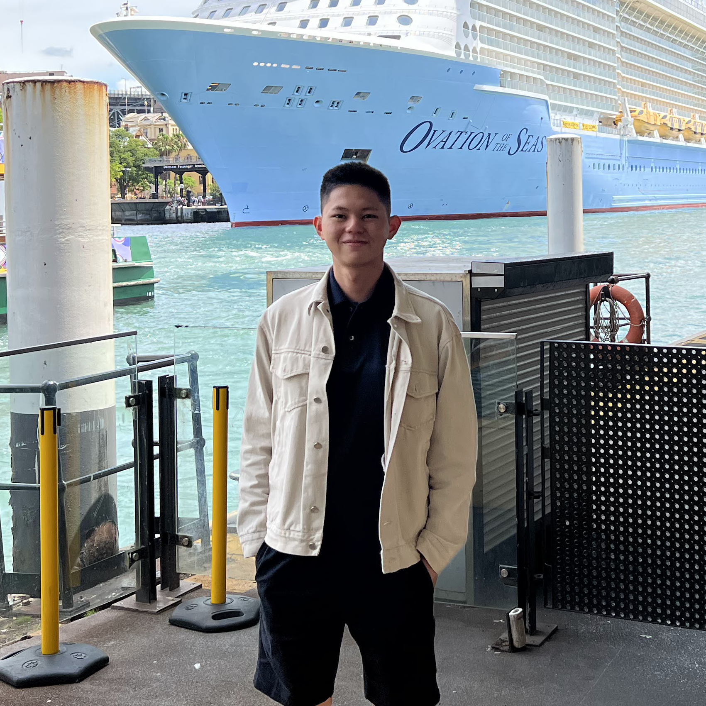

# About
Hi! My name is Nicolai Christian Suhalim and I am from Indonesia!

</img>

Right now, I am in my second year in pursuing an undergraduate degree 
in [Sungkyunkwan University] which is located in South Korea.

I am experienced in coding with C, C++, Java, Kotlin, 
and Python programming languages. I have experienced in working with 
SQLite Database system and Docker Container as well.

I am a hard-working person who is eager to learn new things through 
team work with excellent organization skills. 
Moreover, I am able to live in a dynamic environment 
and I love to solve problems and am motivated to learn and grow in every aspect.

[Sungkyunkwan University]: https://www.skku.edu/eng/index.do