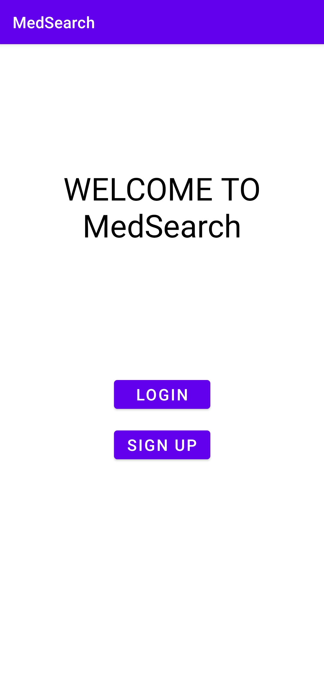
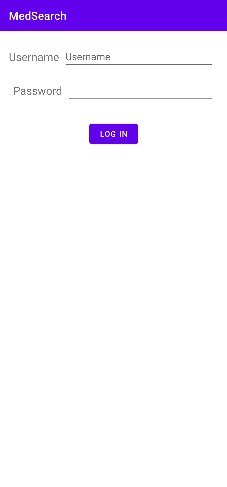
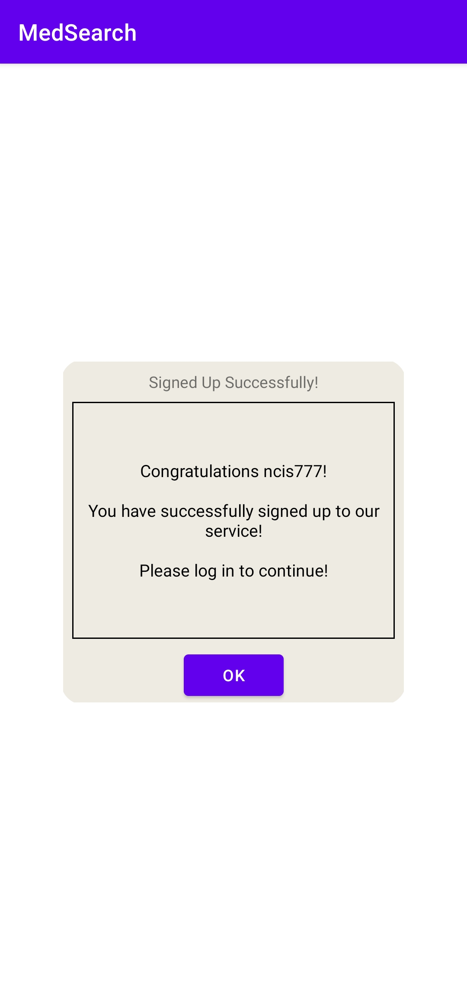
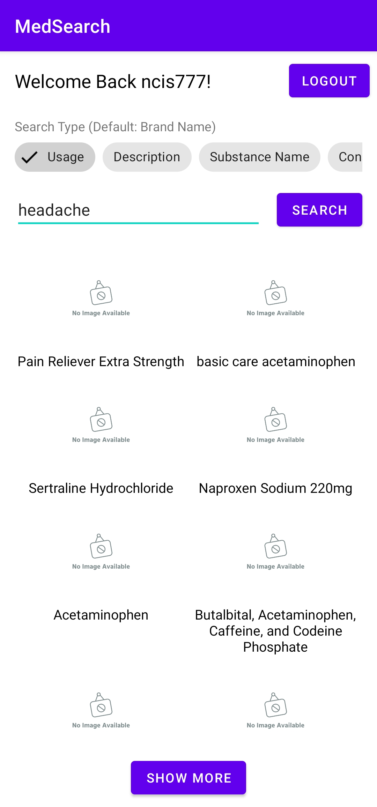

An Android-based application coded using Kotlin that enables its user to search for a medicine through the U.S. Food and Drug Administration (FDA) database.

Below are the screenshots from the application (using Samsung S20 FE device)

<!-- add screenshot -->

> ## Homepage ##
>> Before anything, you are given an option to log in or sign up. Your data will be saved in a serverless json database.
>> 
>> 

> ## Sign-Up Page ##
>> This is the page where you sign up for our service
>> 
>> 

> ## Sign-Up Success Page ##
>> After successfully signing-up to our service, it will show this kind of window
>> 
>> 

> ## Search Page ##
>> This will be the main page, in which you can start searching for the medicines by various categories
>> 
>> 