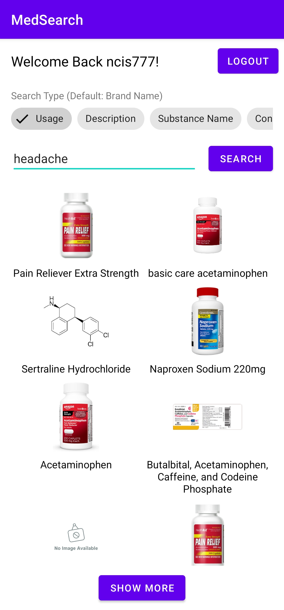
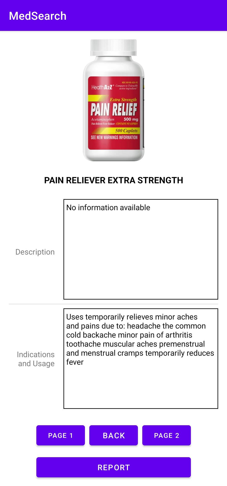
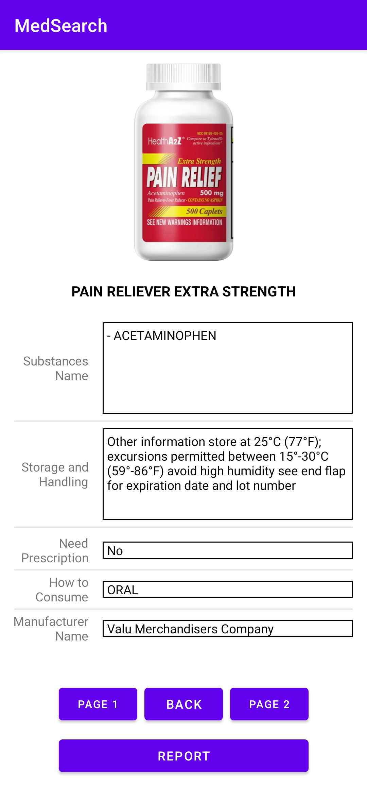
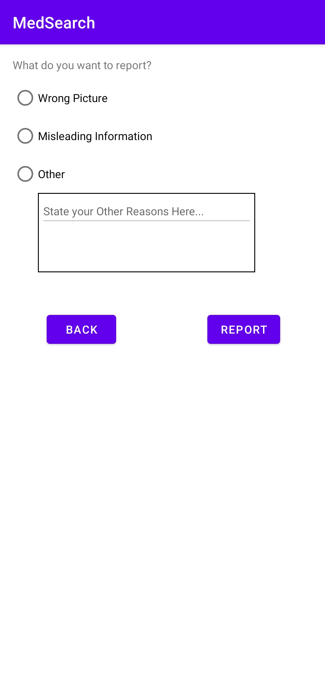

An Android-based application coded using Kotlin that enables its user to search for a medicine through the U.S. Food and Drug Administration (FDA) database.

Before starting, the user will need to sign-up first. This sign-up details will then be saved in serverless JSON database. Then, the user can sign-in using 
the details that he/she just signed-up. If the credentials match with the one saved in the serverless JSON database, then, they are able to use the application.

To search for the medicines, there are a few categories that the user can choose from:
- Brand Name
- Usage
- Description
- Substance Name
- Consumption Way
- Manufacturer Name

Below are the screenshots from the application (using Samsung S20 FE device).

## Homepage
> This will be the first page that the user will see.
> 
> 

## Sign-Up Page
> This is the page where you sign up for our service.
> 
> 

## Sign-Up Success Page
> After successfully signing-up to our service, it will show this kind of window.
> 
> 

## Search Page
> This will be the main page, in which you can start searching for the medicines by various categories.
> 
> 
> 

## Details Page
> When you click, one of the search result, it will show you various information about that medicine.
>
> 
> 

## Report Page
> If you think that there are misinformation anything about the medicine, you can report it through here.
>
> 

For the source code, you can llok it through [this link].

[this link]: https://github.com/nicolaics/medsearch
