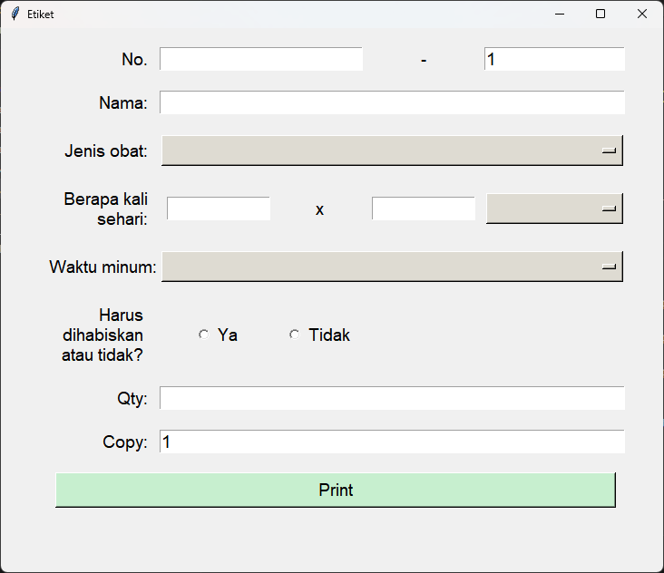
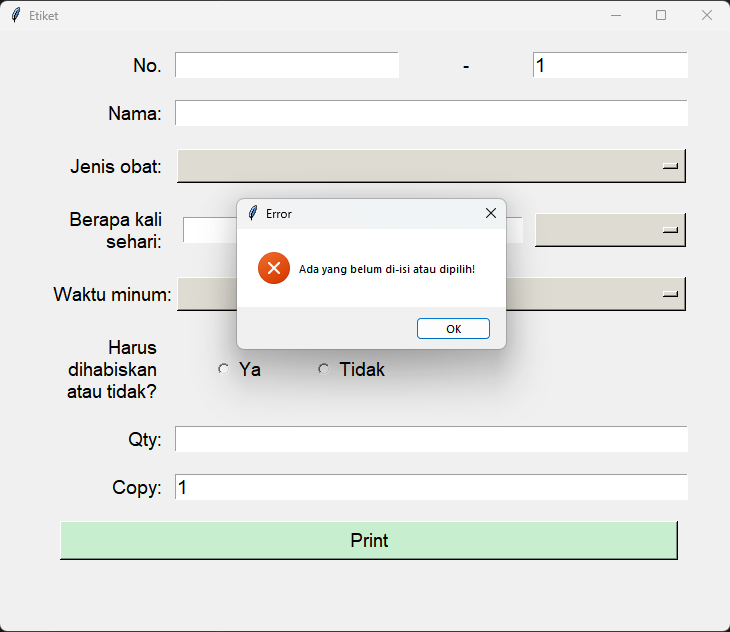
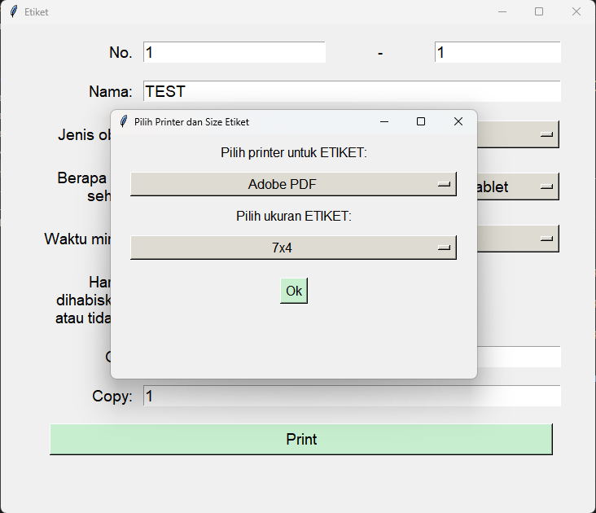

A medicine eticket is an information that tell the consumers on how to consume the medicine, as well as 
its usage.

This program lets you input all the details needed, and then it prints out into an eticket sticker 
with 7x4, 7x5, or 8x3 size sticker paper. The sticker paper is specifically used by a barcode printer.

Below are the screnshots of the software.

## Main Window ##
> This is the main window to input all of the necessary data for the eticket.
> There are (rows):
> - Number
> - Name
> - The medicines usage
> - How many times a day should you consume the medicine, including its unit (Tablet, Capsule, or Syrup)
> - When to consume: Before or After or During Eating
> - Should you finish the medicine or not
> - The quantity of the medicine
> - How many copy do you want to print this eticket
>
> 

## Data Checking ##
> If there is any field that you haven't inputted, you cannot continue to the printing stage. 
> Instead, it will show the window below, that said there is a field that you haven't fill yet.
>
> 

## Printing Page ##
> Here, you can select the printer listed in your computers and select the size of the Eticket.
>
> 