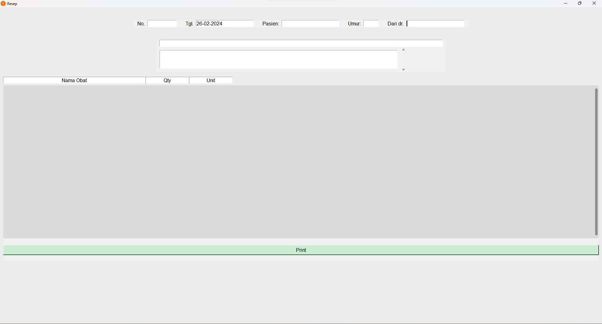
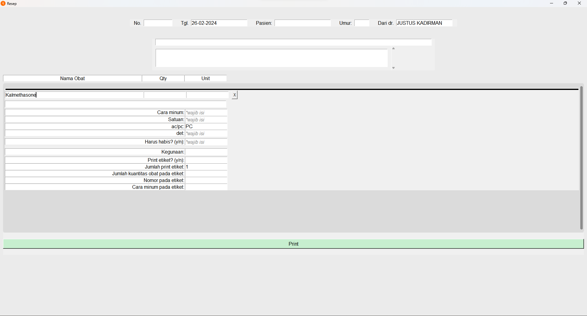
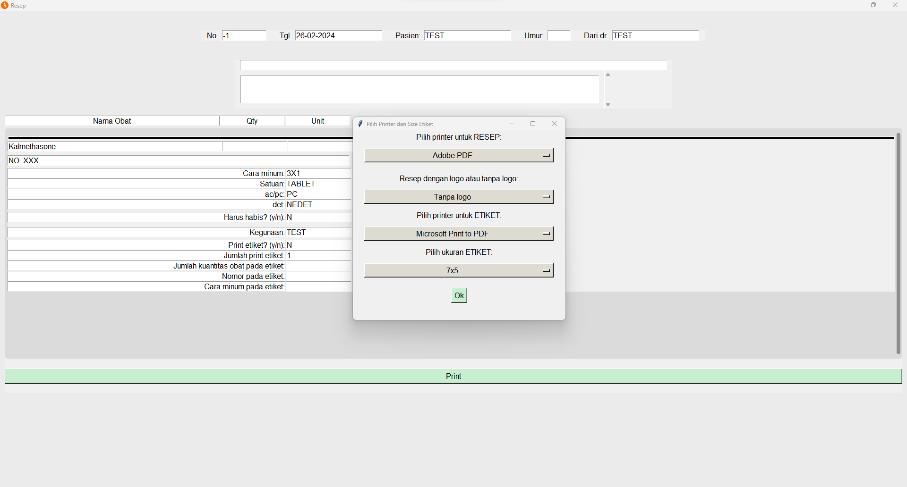
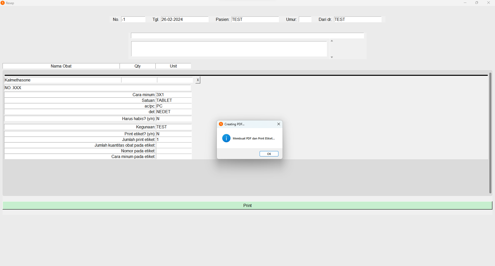
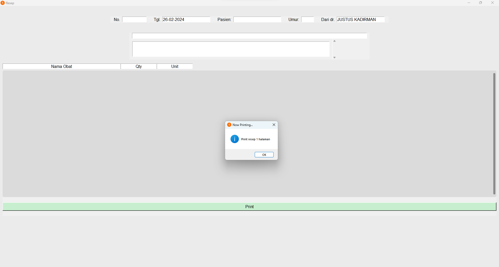

A desktop application written in Python that is specialized for pharmacies to input medicine prescription. 
The prescription is then saved into a Google Firebase Real-time Database.

<!-- add description for searched medicines -->
<!-- add more explanations -->

This software also automatically prints the prescription using a selected printer, 
and it also creates an eticket on what are the usages and how to consume the medicine. 
This eticket will be printed using a selected barcode or sticker printer.

It uses Tkinter GUI library to create the GUI and it incorporates multi-threading as well.

Below are the screenshots of the software.

## Main Window ##
> The main window consists of various fields. Those are:
> - Prescription Number
> - Prescription Date
> - Patient Name
> - Patient's Age
> - Doctor Name
> - Medicine Name
> - Medicine Quantity
> - Medicine Unit
> - A blank space to input "mf"
> - How many times a day should you consume this medicine
> - The medicine unit
> - When to consume it: ac means before eating, pc means after eating
> - Should you finish the medicine or not
> - The usage of the medicine
> - Do you want to print the eticket[1] for this set of medicine
> - If you want to print the eticket, how many copies do you want to print
> - The quantity of the medicine to be printed in the eticket
> - The number of prescription in the eticket
> - How many times a day should you consume the medicine in the eticket
> There is also a blank space for you to search the medicine in the top window.
>
> 
>
> 

## Select Printers ##
> In this window, you select the printer for the prescription and the eticket. 
> You also pick whether the prescription to be printed with the header or not. 
> Then, you should pick the size of the eticket.
>
> 

## Creating and Printing PDF 
> This window shows that the software is now creating the PDF file needed and send it to the printer.
>
> 
>
> 

[1]: Aldfgka